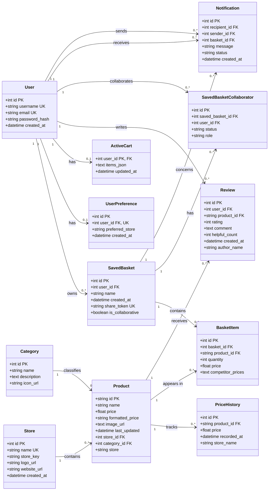

# SmartBasket UML Class Diagram

```mermaid
classDiagram
    direction LR

    class User {
        +int id PK
        +string username UK
        +string email UK
        +string password_hash
        +datetime created_at
    }

    class Store {
        +int id PK
        +string name UK
        +string store_key
        +string logo_url
        +string website_url
        +datetime created_at
    }

    class Category {
        +int id PK
        +string name
        +text description
        +string icon_url
    }

    class Product {
        +string id PK
        +string name
        +float price
        +string formatted_price
        +text image_url
        +datetime last_updated
        +int store_id FK
        +int category_id FK
        +string store
    }

    class PriceHistory {
        +int id PK
        +string product_id FK
        +float price
        +datetime recorded_at
        +string store_name
    }

    class UserPreference {
        +int id PK
        +int user_id FK, UK
        +string preferred_store
        +datetime created_at
    }

    class ActiveCart {
        +int user_id PK, FK
        +text items_json
        +datetime updated_at
    }

    class SavedBasket {
        +int id PK
        +int user_id FK
        +string name
        +datetime created_at
        +string share_token UK
        +boolean is_collaborative
    }

    class BasketItem {
        +int id PK
        +int basket_id FK
        +string product_id FK
        +int quantity
        +float price
        +text competitor_prices
    }

    class Review {
        +int id PK
        +int user_id FK
        +string product_id FK
        +int rating
        +text comment
        +int helpful_count
        +datetime created_at
        +string author_name
    }

    class SavedBasketCollaborator {
        +int id PK
        +int saved_basket_id FK
        +int user_id FK
        +string status
        +string role
    }

    class Notification {
        +int id PK
        +int recipient_id FK
        +int sender_id FK
        +int basket_id FK
        +string message
        +string status
        +datetime created_at
    }

    User "1" --> "0..*" SavedBasket : owns
    User "1" --> "0..1" UserPreference : has
    User "1" --> "0..1" ActiveCart : has
    User "1" --> "0..*" Review : writes
    User "1" --> "0..*" SavedBasketCollaborator : collaborates
    User "1" --> "0..*" Notification : receives
    User "1" --> "0..*" Notification : sends

    Store "1" --> "0..*" Product : contains
    Category "1" --> "0..*" Product : classifies
    Product "1" --> "0..*" PriceHistory : tracks
    Product "1" --> "0..*" BasketItem : appears in
    Product "1" --> "0..*" Review : receives

    SavedBasket "1" --> "0..*" BasketItem : contains
    SavedBasket "1" --> "0..*" SavedBasketCollaborator : has
    SavedBasket "1" --> "0..*" Notification : concerns
```

**Legend:** `PK` = primary key, `FK` = foreign key, `UK` = unique constraint.

**Schema source:** SQLAlchemy models in `app.py`.
